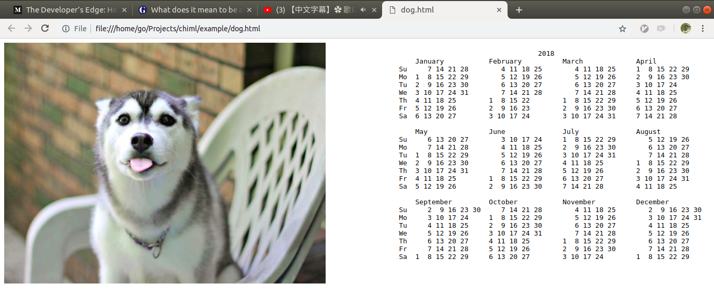

# Calendar Example

## Goal

We want to show calendar on the browser. We also want to show a cute animal image next to the calendar.



## Input

* `year`: any valid number

## Output

* `result`: HTML script that should be shown in the browser

## Bird-view Planning

* `fetchImageAndCalendar`: fetch imageUrl from the internet and calendar from our local machine
* `composeCalendar`: After getting the imageUrl and the calendar, compose them into HTML-script
* `writeCalendar`: Save the HTML-script into a HTML-file
* `showCalendar`: Open the HTML-file using a browser

This bird-view planning can be written in YAML as follow:

```yaml
bootstrap: execute
component:

    execute:
        setup: R.pipeP
        parts:
            - $fetchImageAndCalendar
            - $composeCalendar
            - $writeCalendar
            - $showCalendar
```

## Implementation (without dependency-injection)

In order to make the implementation, we need to break-down our plan and make it more detail:

* `fetchImageAndCalendar`: fetch imageUrl from the internet and calendar from our local machine
    * `fetchImageUrl`: fetch random animal picture from the internet.
        * `fetchImageObj`: fetch image from the internet. This link: `https://aws.random.cat/meow` gives you a random cat in JSON format. We can fetch the image using CURL.
        * `getImageUrl`: After fetching the image object, we need to get the url. In our case, since the JSON response is similar to `{file: "http://some-place/random-cat.jpg"}`, we have to extract the `file` key.
    * `fetchCalendar`: simply setup `ncal <year> -h`, and we will get the calendar
* `composeCalendar`: After getting the imageUrl and the calendar, compose them into HTML-script. String concatenation should do it. And in UNIX-like system, we have `echo` command. So, we can just use it. No need to code anything.
* `writeCalendar`: Save the HTML-script into a HTML-file. Writing to a calendar is as easy as `echo "content" > file.html`
* `showCalendar`: Open the HTML-file using a browser. We can open google chrome usiing this command: `google-chrome file://some-folder/some-file.html`

Below is the detail implementation, as well as our executable CHIML program:

__animal-calendar.yml__

```yaml
bootstrap: execute
component:

    execute:
        setup: R.pipeP
        parts:
            - $fetchImageAndCalendar
            - $composeCalendar
            - $writeHtml
            - $showCalendar

    fetchImageAndCalendar:
        [X.concurrent, $fetchImageUrl, $fetchCalendar]

    composeCalendar:
        [R.apply, $composeHtml]

    composeHtml:
        setup: X.wrapCommand
        parts: echo '<pre>' ${2} '</pre>'

    writeHtml:
        [X.wrapCommand, "echo ${1} > ${PWD}/calendar.html"]

    showCalendar:
        [X.wrapCommand, "google-chrome file://${PWD}/calendar.html"]

    fetchCalendar:
        [X.wrapCommand, "ncal ${1} -h"]

    fetchImageUrl:
        [R.pipeP, $fetchImageObj, $extractImageUrl]

    fetchImageObj:
        arity: 0
        setup: X.wrapCommand
        parts: [curl https://aws.random.cat/meow]

    extractImageUrl:
        [R.prop, file]
```

Now you can simply setup `chie -c animal-calendar.yml 2017`

## Implementation (with dependency-injection)

Our previous implementation is highly opinionated. We use `ncal` to generate calendar, we use `random-cat API`, eventhough some users prefer dog, and we use google-chrome as our browser of choice. Now, how if you want dog instead of cat?

We have something named `inversion of control` aka `dependency injection`. What we need to do is providing the injection in other files. If you are familiar with typescript, you can make a directory with the following structure:

```
.
├── animal-calendar.yml
├── src
│   ├── baseCalendarInjection.ts
│   ├── injection.cat.ts
│   ├── injection.dog.ts
│   └── interfaces
│       └── baseCalendarInjection.ts
└── tsconfig.json
```

First of all, I define my `tsconfig.json` as follow:

__tsconfig.json__

```json
{
    "compileOnSave": true,
    "compilerOptions": {
        "module": "commonjs",
        "target": "es2015",
        "experimentalDecorators": true,
        "declaration": true,
        "outDir": "./dist",
        "rootDir": "./src"
    },
    "include": [
        "src/**/*"
    ],
    "sourceMaps": true
}
```

Then we define our container, `animal-calendar.yml`:

__animal-calendar.yml__

```yaml
bootstrap: execute
injection: ./dist/injection.cat.js
component:

    execute:
        setup: R.pipeP
        parts:
            - $fetchImageAndCalendar
            - $composeCalendar
            - $writeHtml
            - $showCalendar

    fetchImageAndCalendar:
        [X.concurrent, $fetchImageUrl, $fetchCalendar]

    composeCalendar:
        [R.apply, $injection.composeHtml]

    writeHtml:
        [X.wrapCommand, $injection.writeHtmlCommand]

    showCalendar:
        [X.wrapCommand, $injection.showCalendarCommand]

    fetchCalendar:
        [X.wrapCommand, $injection.calCommand]

    fetchImageUrl:
        [R.pipeP, $fetchImageObj, $extractImageUrl]

    fetchImageObj:
        arity: 0
        setup: X.wrapCommand
        parts: [$injection.imageFetcherCommand]

    extractImageUrl:
        [R.prop, $injection.imageKey]
```

By default, this container will use `./dist/catCalendarInjection.js`. The file is currently inexist. You might notice that we have some `undefined components` like `injection.composeHtml`, `injection.writeHtmlCommand`, `injection.showCalendarCommand`, `injection.calCommand`, `injection.imageFetcherCommand`, and `injection.imageKey`. It's okay, we will define the interface and the implementation later.

Interface is like a contract. In this case, we want our interface to provide several functions and values that can be used in the container. Below is the content of `/src/interfaces/baseCalendarInjection.ts`:

__src/interfaces/baseCalendarInjection.ts__

```typescript
export interface IBaseCalendarInjection {
    calCommand: string;
    composeHtml: (imageUrl: string, calendar: string) => string;
    imageFetcherCommand: string;
    imageKey: string;
    writeHtmlCommand: string;
    showCalendarCommand: string;
}
```

After creating the interface, we can proceed by creating `baseCalendarInjection.ts`.

__src/baseCalendarInjection.ts__

```typescript
import { IBaseCalendarInjection } from "./interfaces/baseCalendarInjection";

export class BaseCalendarInjection implements IBaseCalendarInjection {

    public calCommand: string = "ncal ${1} -h";
    public imageFetcherCommand: string = "curl https://somewhere.com/randomImage.json";
    public imageKey: string = "image";
    public writeHtmlCommand: string = `echo \${1} > "${__dirname}/calendar.html"`;
    public showCalendarCommand: string = `google-chrome file://${__dirname}/calendar.html`;

    public composeHtml(imageUrl: string, calendar: string): string {
        return `` +
            `<pre style="float:right">${calendar}</pre>`;
    }

}
```

Lastly, let's make `injection.cat.ts` and `injection.dog.ts`.

__src/injection.cat.ts__

```typescript
import { BaseCalendarInjection } from "./baseCalendarInjection";
import { IBaseCalendarInjection } from "./interfaces/baseCalendarInjection";

class CatCalendarInjection extends BaseCalendarInjection implements IBaseCalendarInjection {
    public imageFetcherCommand: string = "curl https://aws.random.cat/meow";
    public imageKey: string = "file";
    public writeHtmlCommand: string = `echo \${1} > "${__dirname}/../cat.html"`;
    public showCalendarCommand: string = `google-chrome file://${__dirname}/../cat.html`;
}

const injection = new CatCalendarInjection();
module.exports = injection;
```

__src/injection.dog.ts__

```typescript
import { BaseCalendarInjection } from "./baseCalendarInjection";
import { IBaseCalendarInjection } from "./interfaces/baseCalendarInjection";

class DogCalendarInjection extends BaseCalendarInjection implements IBaseCalendarInjection {
    public imageFetcherCommand: string = "curl https://random.dog/woof.json";
    public imageKey: string = "url";
    public writeHtmlCommand: string = `echo \${1} > "${__dirname}/../dog.html"`;
    public showCalendarCommand: string = `google-chrome file://${__dirname}/../dog.html`;
}

const injection = new DogCalendarInjection();
module.exports = injection;
```

Now we can show both, cat and dog calendar, using the following commands:

```
tsc --build ./tsconfig.json
chie animal-calendar.yml 2018
```

or

```
tsc --build ./tsconfig.json
chie --injection ./dist/injection.dog.js --container ./animal-calendar.yml 2019
```

or

```
tsc --build ./tsconfig.json
chie -i ./dist/injection.dog.js -c ./animal-calendar.yml 2019
```

or

```
tsc --build ./tsconfig.json
chie -i "./dist/injection.dog.js as injection" -c ./animal-calendar.yml 2019
```

